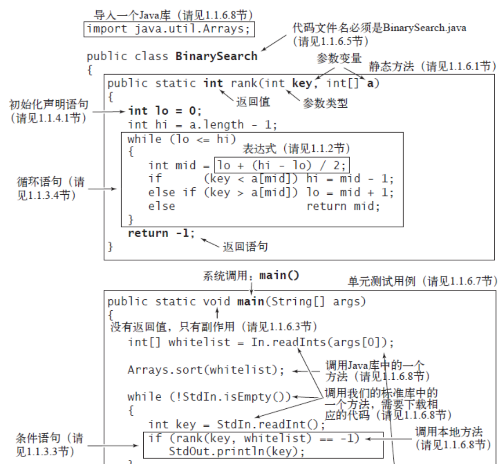
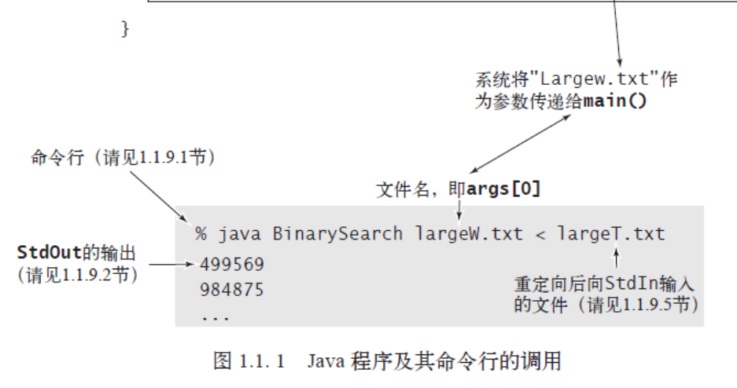
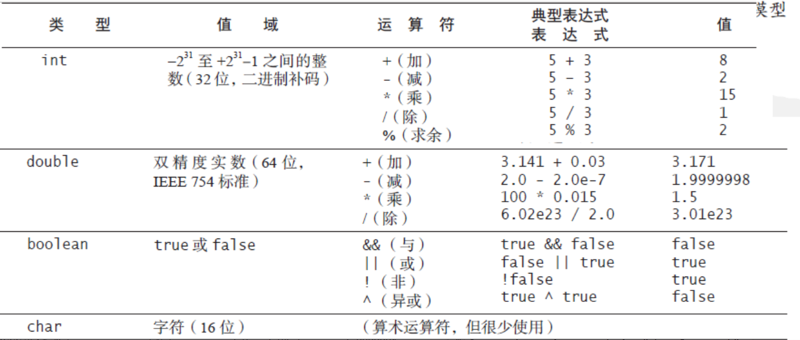
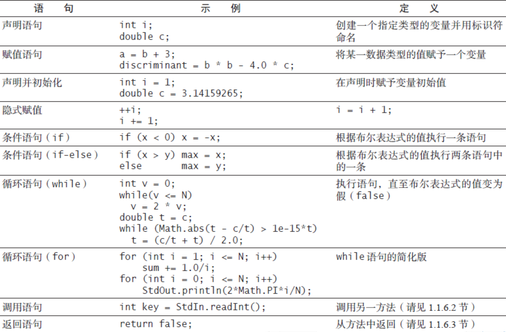
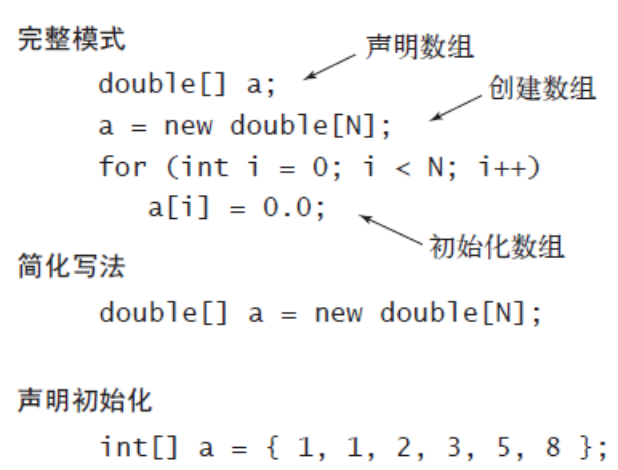
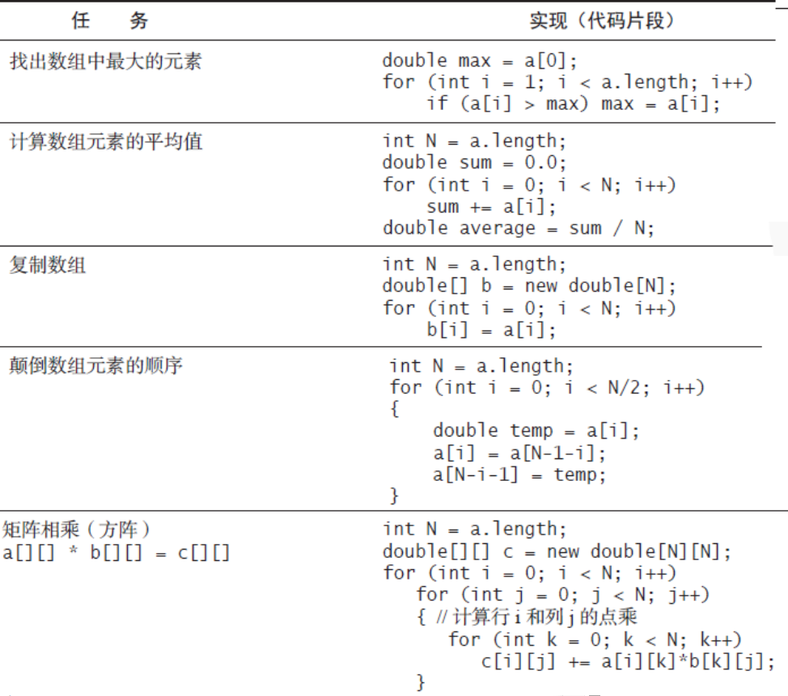
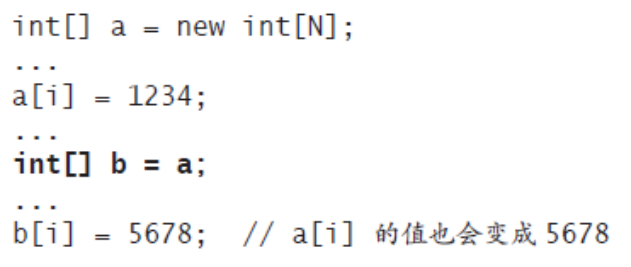

## 基础编程模型
### Java程序的基本结构
* 本书学习算法的方法：用Java编程语言编写的程序来实现算法(相比用自然语言有很多优势)
* 劣势：编程语言特定，使算法的思想和实现细节变得困难(所以本书尽量使用大部分语言都必须的语法)
* 把描述和实现算法所用到的语言特性、软件库和操作系统特定总称为基础编程模型
* Java程序的基本结构
  * 一段Java程序或者是一个静态方法库，或者定义了一个数据类型，需要用到的语法
    * 原始数据类型(在计算机中精确地定义整数浮点数布尔值等)
    * 语句(创建变量并赋值，控制运行流程或引发副作用来进行计算，包括声明、赋值、条件、循环、调用和返回)
    * 数组(多个同种数据类型值的集合)
    * 静态方法(封装并重用代码)
    * 字符串(一连串的字符，内置一些对他们的操作)
    * 标准输入/输出(是程序与外界联系的桥梁)
    * 数据抽象(数据抽象封装和重用代码，可以定义非原始数据类型，进而面向对象编程)
  * 把这种输入命令执行程序的环境称为 虚拟终端
  * 要执行一条Java程序，需要先用javac命令编译，然后用java命令运行，比如下面的文件，需要使用命令
      ``` 
      javac BinarySearch.java
      java BinarySearch 
      ```  
    
    
  
### 原始数据类型与表达式
* 数据类型就是一组数据和其所能进行的操作的集合
* Java中最基础的数据类型(整型int，双精度实数类型double,布尔值boolean,字符型char)
* Java程序控制用标识符命名的变量
* 对于原始类型，用标识符引用变量，+-*/指定操作，用字面量来表示值(如1或3.14),用表达式表示对值的操作( 表达式:(x+2.334)/2 )
* 只要能够指定值域和在此值域上的操作，就能定义一个数据类型(很像数学上函数的定义)
* +-*/是被重载过的
* 运算产生的数据的数据类型和参与运算的数据的数据类型是相同的(5/3=1,5.0/3.0=1.6667等)
* 如下图(图歪了亿点点..)
  
* 表达式
 * 表达式具有优先级，Java使用的是中缀表达式(一个字面量紧接运算符，然后是另一个字面量)。逻辑运算中优先级 !  &&  || ,运算符中 * / % 高于+ - 。括号能改变这些规则。代码中尽量使用括号消除对优先级的依赖
 * 类型转换  
   * 数值会自动提升为高级数据类型，如1+2.5 1会被先转为double 1.0，值也为double的3.5
   * 强转(把类型名放在括号里讲其转换为括号中的类型) 讲高级数据类型转为低级可能会导致精度的缺失，尽量少使用
 * 比较
   * ==、!=、<、<=、>、>=，这些运算符称为 混合类型运算符，因为结果是布尔型而不是参与比较的数据类型
   * 结果是布尔型的表达式称为布尔表达式
 * 其他原始类型(int为32位，double为64位)
   * long,64位整数
   * short,16位整数
   * char,16位字符
   * byte,8位整数
   * 32位单精度实数,float
### 语句
* 语句用来创建和操作变量、对变量赋值并控制操作的执行流程
* 包括声明语句、赋值语句、条件语句、循环语句、调用和返回语句
* 声明：让一个变量名和一个类型在编译时关联起来
* 赋值：将(由一个表达式定义的)某个数据类型额值和一个变量关联起来
* 条件语句：
    ``` 
    if (<boolean expression>) { <block statement> }
    ```
* 循环语句
    ``` 
    while(<boolean expression>) { <block statement> }
    ```  
  其中循环语句中的代码段称为循环体
* break与continue语句
  * break，立即退出循环
  * continue，立即开始下一轮循环
### 简便记法
  * 声明并初始化
  * 隐式赋值
    * ++i;--i
    * i/=2;i+=1
  * 单语句代码段(省略if/while代码段的花括号)
  * for语句
    ``` 
    for(<initialize>;<boolean expression>;<increment>)
    {
        <block statements>
    }
    ```  
    这段代码等价于后面的
    ``` 
    <initialize>;
    while(<boolean expression>)
    {
      <block statments>
      <increment>;
    }
    ```
  * java语句总结  
  
### 数组
* 数组能够存储相同类型的多个数据
* N个数组的数组编号为0至N-1；这种数组在Java中称为一维数组
* 创建并初始化数组
  * 需要三个步骤，声明数组名字和类型，创建数组，初始化数组元素
  * 声明并初始化一个数组  
  
  * 简化写法  
  double[] a = new double[N];
  * 使用数组(访问的索引小于0或者大于N-1时会抛出ArrayIndexOutOfBoundsException)
  * 典型的数组处理代码  
  
* 起别名  
  * 下面的情况并没有将数组新复制一份，而是a，b指向了同一个数组  
  
* 二维数组
  * Java中二维数组就是一堆数组的数组
  * 二维数组可以是参差不齐，比如a[0]=new double[5],a[1]=new double[6]之类
  * 二维数组的创建及初始化
    ``` 
    double[][] a;
    a = new double[M][N];
    for (int i = 0; i < M; i++)
        for (int j = 0; j < N; j++)
            a[i][j] = 0.0;
    ```
  * 精简后的代码
  double[][] a=new double[M][N];