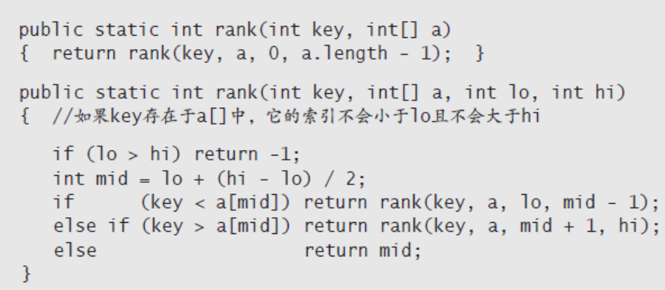
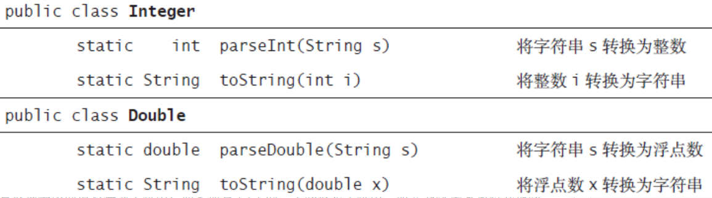

## 基础编程模型
### 静态方法
* 本书中所有的Java程序要么是数据类型的定义，要么是一个静态方法库
* 当讨论静态方法和实体方法共有的属性时，我们会使用不加定语的方法一词
* 方法需要参数(某种数据类型的值)并根据参数计算出某种数据类型的返回值(例如数学函数的结果)或者产生某种副作用(例如打印一个值)
* 静态方法由签名(public static 以及函数的返回值,方法名及一串参数)和函数体组成
* 调用静态方法(写出方法名并在后面的括号中列出数值)
* 方法的性质  
  * 方法的参数按值传递，方法中使用的参数变量能够引用调用者的参数并改变其内容(只是不能改变***原数组变量***本身)
  * 方法名可以被重载
  * 方法只能返回一个值，但能包含多个返回语句
  * 方法可以产生副作用
* 递归：方法可以调用自己
  可以使用数学归纳法证明所解释算法的正确性,编写递归重要的三点
  * 递归总有一个最简单的情况(方法第一条总包含return的条件语句)
  * 递归调用总是去尝试解决一个规模更小的子问题
  * 递归调用的父问题和尝试解决的子问题之间不应该由交集
    如下图中，两个子问题各自操作的数组部分是不同的  
    
* 基础编程模型  
  * 静态方法库是定义在一个Java类中的一组静态方法
  * Java开发的基本模式是编写一个静态方法库(包含一个main()方法)类完成一个任务  
  * 在本书中，当我们提到用于执行一项人物的Java程序时，我们指的就是用这种模式开发的代码(还包括对数据类型的定义)
* 模块化编程  
  * 通过静态方法库实现了模块化编程  
  * 一个库中的静态方法也能够调用另一个库中定义的静态方法
* 单元测试
  * Java编程最佳实践之一就是每个静态方法库中都包含一个main()函数来测试库中所有的方法
  * 本书中使用main()来说明模块的功能并将测试用例留作练习
* 外部库
  * 系统标准库 java.lang.*:包括Math库;String和StringBuilder库
  * 导入的系统库 java.util.Arrays
  * 本书中其他库
  * 本书使用了作者开发的标准库Std*
### API
* 模块化编程重要组成部分，记录库方法的用法并供其他人参考的文档
* 会统一使用应用程序编程接口API的方法列出每个库方法、签名及简述
* 用例(调用另一个库中的方法的程序)，实现(实现了某个API方法的Java代码)
* 作者自己的两个库，一个扩展Math.random(),一个支持各种统计  
  * 随机静态方法库(StdRandom)的API  
  
  * 数据分析方法库(StdStats)的API  
  
  * StdRandom库中的静态方法的实现
  
* 编写自己的库
  * 编写用例，实现中将计算过程分解
  * 明确静态方法库和与之对应的API
  * 实现API和一个能够对方法进行独立测试的main()函数
  * API的目的是将调用和实现分离
### 字符串
* 字符串拼接，使用 + 
* 类型转换(将用户从键盘输入的内容转换成相应数据类型的值以及将各种数据类型的值转换成能够在屏幕上显示的值)  

* 如果数字跟在+后面，那么会将数据类型的值自动转换为字符串
* 命令行参数  
  * Java中字符串的存在，使程序能够接收到从命令行传递来的信息
  * 当输入命令java和一个库名及一系列字符串后，Java系统会调用库的main()方法并将后面的一系列字符串变成一个数组作为参数传递给它
### 输入输出
* Java程序可以从***命令行参数***或者一个名为***标准输入流***的抽象字符流中获得输入，并将输出写入另一个名为标准输出流的字符流中
* 默认情况下，命令行参数、标准输入和标准输出是和应用程序绑定的，而应用程序是由能够接受命令输入的操作系统或是开发环境所支持
* 使用终端来指代这个应用程序提供的供输入和显示的窗口,如图  

* 命令和参数  
  * 终端窗口包含一个提示符，通过它我们能够向操作系统输入命令和参数
  * 操作系统常用命令  
  
* 标准输出  
  * StdOut库的作用是支持标准输出
  * 标准输出库的静态方法的API  
  
  * 格式化输出 字符%并紧跟一个字符表示的转换代码(包括d,f和s)。%和转换代码之间可以插入证书表示值的宽度，且转换后会在字符串左边添加空格以达到需要的宽度。负数表示空格从右边加
  * 宽度后用小数点及数值可以指定精度(或String字符串所截取的长度)
  * 格式中转换代码和对应参数的数据类型必须匹配
  
* 标准输入
  * StdIn库从标准输入流中获取数据，然后将标准输出定向到终端窗口
  * 标准输入流最重要的特点，这些值会在程序读取后消失
  * 例子  
  
  * 标准输入库中的静态方法API  
  
* 重定向和管道
  * 将标准输出重定向到一个文件
    ``` 
    java RandomSeq 1000 100.0 200.0 > data.txt
    ```
  * 从文件而不是终端应用程序中读取数据
    ``` 
    java Average < data.txt
    ```
  * 将一个程序的输出重定向为另一个程序的输入，叫做管道  
    ``` 
    java RandomSeq 1000 100.0 200.0 | java Average
    ```  
      * 突破了我们能够处理的输入输出流的长度限制  
      * 即使计算机没有足够的空间来存储十亿个数，
      * 我们仍然可以将例子中的1000 换成1 000 000 000 （当然我们还是需要一些时间来处理它们）。当RandomSeq 调用StdOut.println() 时，它就向输出流的末尾添加了一个字符串；当Average 调用StdIn.readInt() 时，它就从输入流的开头删除了一个字符串。这些动作发生的实际顺序取决于操作系统
  * 命令行的重定向及管道  
  
* 基于文件的输入输出
 * In和Out库提供了一些静态方法,来实现向文件中写入或从文件中读取一个原始数据类型的数组的抽象
 * 用于读取和写入数组的静态方法的API  
 
 * 标准绘图库(基本方法和控制方法)--这里跳过
### 二分查找
* 如图，在终端接收需要判断的数字，如果不存在于白名单(文件中的int数组)中则输出
* 开发用例以及使用测试文件(数组长度很大的白名单)
* 模拟实际情况来展示当前算法的必要性，比如  
  * 将客户的账号保存在一个文件中，我们称它为白名单；
  * 从标准输入中得到每笔交易的账号；
  * 使用这个测试用例在标准输出中打印所有与任何客户无关的账号，公司很可能拒绝此类交易。

* 使用顺序查找  
  ``` 
  public static int rank(int key, int[] a)
  {
    for (int i = 0; i < a.length; i++)
      if (a[i] == key) return i;
    return -1;
  }
  ```
* 当处理大量输入的时候，顺序查找的效率极其低
### 展望
* 下一节，鼓励使用数据抽象，或称面向对象编程，而不是操作预定义的数据类型的静态方法
* 使用数据抽象的好处
  * 复用性
  * 链式数据结构比数组更灵活
  * 可以准确地定义锁面对的算法问题
### 1.1 End