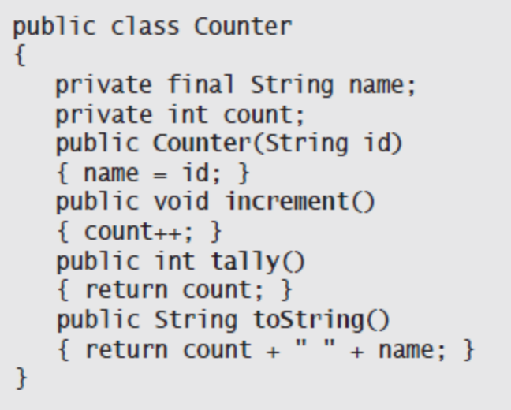
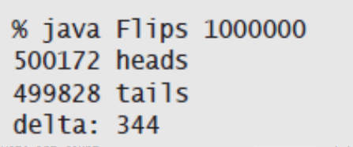

## 数据抽象
***数据类型***指的是一组值和一组对这些值的操作的集合  
* 定义和使用数据类型的过程，也被称为数据抽象
* Java编程的基础是使用class关键字构造被称为***引用类型***的数据类型，也称面向对象编程
* 定义自己的数据类型来抽象任意对象
* 抽象数据类型（ADT）是一种能够对使用者隐藏数据表示的数据类型
* 抽象数据类型将数据和函数的实现相关联，将数据的表示方式隐藏起来
* 抽象数据类型使用时，关注API描述的操作上而不会去关心数据的表示；实现抽象数据类型时，关注数据本身并将实现对数据的各种操作
* 研究同一个问题的不同算法的主要原因是他们的性能不同  
### 使用抽象数据类型
* 使用一种数据类型并不一定非得知道它是如何实现的
* 使用Counter(计数器)的简单数据类型的程序，操作有
  * 创建对象并初始化为0
  * 当前值加1
  * 获取当前值
* 场景，用于电子计票
* 抽象数据类型的API(应用程序编程接口)
  * API用来说明抽象数据类型的行为
  * 将列出所有构造函数和实例方法(即操作)
* 计算器的API  

* 继承的方法
  * 所有数据类型都会继承toString()方法
  * Java会在用+运算符将任意数据类型的值和String值连接时调用toString()
  * 默认实现：返回该数据类型值的内存地址
* 用例代码
  * 可以在用例代码中，声明变量、创建对象来保存数据类型的值并允许通过实例方法来操作它们
* 对象
  * 对象是能够承载数据类型的值的实体
  * 对象三大特性：状态、标识和行为
    * 状态：数据类型中的值
    * 标识：在内存中的地址
    * 行为：数据类型的操作
  * Java使用"引用类型"和原始数据类型区别
* 创建对象
  * 每种数据类型中的值都存储于一个对象中
  * 构造函数总是返回他的数据类型的对象的引用
  * 使用new()，会为新的对象分配内存空间，调用构造函数初始化对象中的值，返回该对象的一个引用
* 抽象数据类型向用例隐藏了值的表示细节
* 实例方法：参数按值传递
* 方法每次触发都和一个对象相关
* 静态方法的主要作用是实现函数；非静态(实例)方法的主要作用是实现数据类型的操作
* 使用对象  
开发某种数据类型的用例
  * 声明该类型的变量，以引用对象
  * 使用new触发能够创建该类型的对象的一个构造函数
  * 使用变量名调用实例方法
* 赋值语句(对象赋值)
  * 别名：两个变量同时指向同一个对象
* 将对象作为参数
  * Java将参数值的一个副本从调用端传递给了方法，这种方式称为按值传递
  * 当使用引用类型作为参数时我们创建的都是别名，这种约定会传递引用的值(复制引用)，也就是传递对象的引用
  * 虽然无法改变原始的引用(将原变量指向另一个Counter对象)，但能够改变该对象的值
* 将对象作为返回值
  * 由于Java只由一个返回值，有了对象实际上就能返回多个值
* 数组也是对象
  * 将数组传递给一个方法或是将一个数组变量放在赋值语句的右侧时，我们都是在创建数组引用的一个副本，而非数组的副本
* 对象的数组  
创建一个对象的数组
  * 使用方括号语法调用数组的构造函数创建数组
  * 对于每个数组元素调用它的构造函数创建相应的对象  
  如下图  
  
* 运用数据抽象的思想编写代码(定义和使用数据类型，将数据类型的值封装在对象中)的方式称为面向对象编程
* 总结
  * 数据类型指的是一组值和一组对值的操作的集合
  * 我们会在数据类型的Java类中编写用理
  * 对象是能够存储任意该数据类型的值的实体
  * 对象有三个关键性质：状态、标识和行为
### 抽象数据类型举例
* 本书中将会用到或开发的所有数据类型
  * java.lang.* 
  * Java标准库中的抽象数据类型，需要import，比如java.io、java.net等
  * I/O处理嘞抽象数据类型,StdIn和StdOut
  * 面向数据类抽象数据类型，计算机和和信息处理
  * 集合类抽象数据类型，主要是为了简化对同一类型的一组数据的操作，包括Bag、Stack和Queue，PQ(优先队列)、ST(符号表)、SET(集合)
  * 面向操作的抽象数据类型(用来分析各种算法)
  * 图算法相关的抽象数据类型，用来封装各种图的表示的面向数据的抽象数据类型，和一些提供图的处理算法的面向操作的抽象数据类型
* 几何对象(画图(图形)的)[跳过]
* 信息处理
  * 抽象数据类型是组织信息的一种自然方式
  * 定义和真实世界中的物体相对应的对象
* 字符串  
  * java的String
  * 一个String值是一串可以由索引访问的char值
  * 有了String类型可以写出清晰干净的用例代码而无需关心字符串的表示方式
### 抽象数据类型的实现
* 使用Java的类(class)实现抽象数据类型并将所有代码放入一个和类名相同并带有.java扩展名的文件
* 如下图  

* 实例变量  
用来定义数据类型的值(每个对象的状态)  
* 构造函数  
  * 每个Java类都至少有一个构造函数以创建一个对象的标识
  * 每个构造函数将创建一个对象并向调用者返回一个该对象的引用  
* 实例方法  
  * 如图  
  
* 作用域  
  * 参数变量、局部变量、实例变量
  *  范围(如图)  
  
* API、用例与实现  
  * 我们要学习的每个抽象数据类型的实现，都会是一个含有若干私有实例变量、构造函数、实例方法和一个测试用例的Java类
  * 用例和实现分离(一般将用例独立成含有静态方法main()的类)
  * 做法如下  
    * 定义一份API，APi的作用是将使用和实现分离，以实现模块化编程
    * 用一个Java类**实现**API的定义
    * 实现多个测试用例来验证前两步做出的设计决定
  * 例子如下
    * API  
    
    * 典型用例  
    
    * 数据类型的实现  
    
    * 使用方法(执行程序)  
    

### 更多抽象数据类型的实现
* 日期  
  * 两种实现方式  
    
  * 本书反复出现的主题，即理解各种实现对空间和时间的需求  
* 维护多个实现  
  * 比较同一份API的两种实现在同一个用例中的性能表现，需要下面非正式的命名约定
    * 使用前缀的描述性修饰符，比如BasicDate和SmallDate,以及是否合法的SmartDate
    * 适合大多数用力的需求的实现，比如Date
* 累加器  

### 数据类型的设计  
* 抽象数据类型是一种向用例隐藏内部表示的数据类型
  * 封装(数据封装)  
  * 设计APi  
* 算法与抽象数据类型  
  * 能够准确地说明一个算法的目的及其他程序应该如何使用该算法
  * 每个Java程序都是一组静态方法和(或)一种数据类型的实现的集合
* 本书中关注的是抽象数据类型的实现中的操作和向用例隐藏其中的数据表示
* 例子，将二分法封装  
  * API  
  
  * 典型的用例  
  
  * 数据类型的实现  
  
* 接口继承  
  * Java语言为定义对象之间的关系提供了支持，称为接口
  * 接口继承使得我们的程序能够通过调用接口中的方法操作实现该接口的任意类型的对象  
* 本书中使用到的接口  

* 继承
  * 由Object类继承得到的方法  
  
  * 继承toString()并自定义
  * 封装类型(内置的引用类型，包括Boolean、Byte、Character、Double、Float、Integer、Long和Short)
* 等价性  
  * 如图  
  
  * 例子，在Date中重写equals  
  
* 内存管理  
  Java具有自动内存管理，通过记录孤儿对象并将它们的内存释放到内存池中
* 不可变性  
使用final保证数据不可变  
使用final修饰的引用类型，不能再引用(指向)其他对象，但对象本身的值可改变  
* 契约式设计  
  * Java语言能够在程序运行时检测程序状态
  * 异常(Exception)+断言(Assertion)
* 异常与错误  
允许抛出异常或抛出错误  
* 断言  
程序不应该依赖断言 
### End  