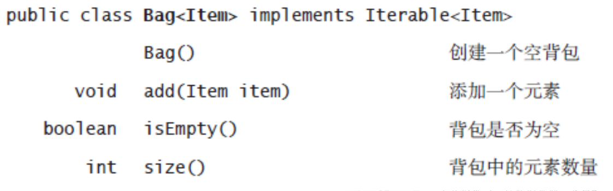
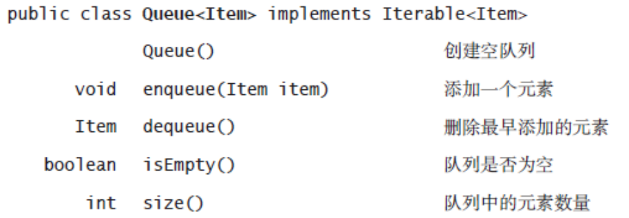
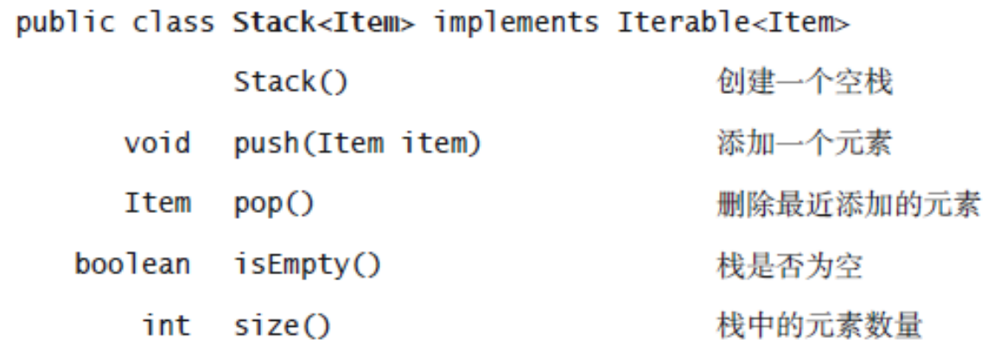
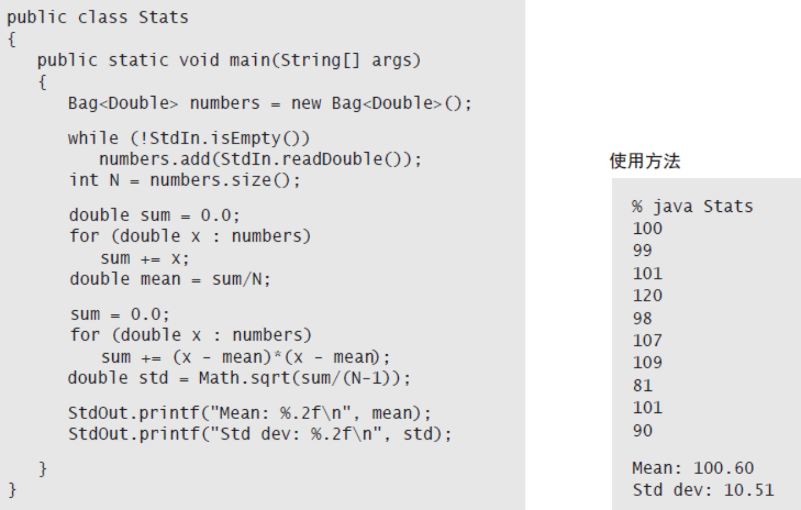
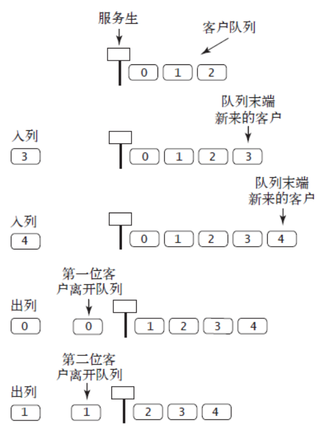

## 背包、队列和栈  
* 数据类型的值就是一组对象的集合，所有操作都是关于添加、删除或是访问集合中的对象  
* 本章将学习三种数据类型：背包Bag、队列Queue、栈Stack  
  * 对集合中的对象的表示方式直接影响各种操作的效率  
  * 介绍泛型和迭代  
  * 介绍并说明链式数据结构的重要性(链表) 
### API   
* 泛型可迭代的基础集合数据类型的API
  * 背包  
  
  * 队列(先进先出FIFO)  
  
  * 下压(后进先出,LIFO)栈
  
* 泛型  
  * 泛型，参数化类型  
  * 在每份API 中，类名后的<Item> 记号将Item 定义为一个类型参数，它是一个象征性的占位符，表示的是用例将会使用的某种具体数据类型  
* 自动装箱  
  * 用来处理原始类型  
  * Boolean、Byte、Character、Double、Float、Integer、Long 和Short 分别对应着boolean、byte、char、double、float、int、long 和short  
  * 自动将一个原始数据类型转换为一个封装类型称为自动装箱，自动将一个封装类型转换为一个原始数据类型被称为自动拆箱  
* 可迭代的集合类型  
  * 迭代访问集合中的所有元素  
* 背包是一种不支持从中删除元素的集合数据类型--帮助用例收集元素并迭代遍历所有收集到的元素（**无序遍历**）  
  * 典型用例，计算标准差  
  
* 先进先出队列  
  * 是一种基于先进先出(FIFO)策略的集合类型  
  * 使用队列的主要原因：集合保存元素的同时保存它们的相对顺序  
  * 如图  
  
  * Queue用例  
  
### 集合类数据类型的实现
### 链表
### 综述
