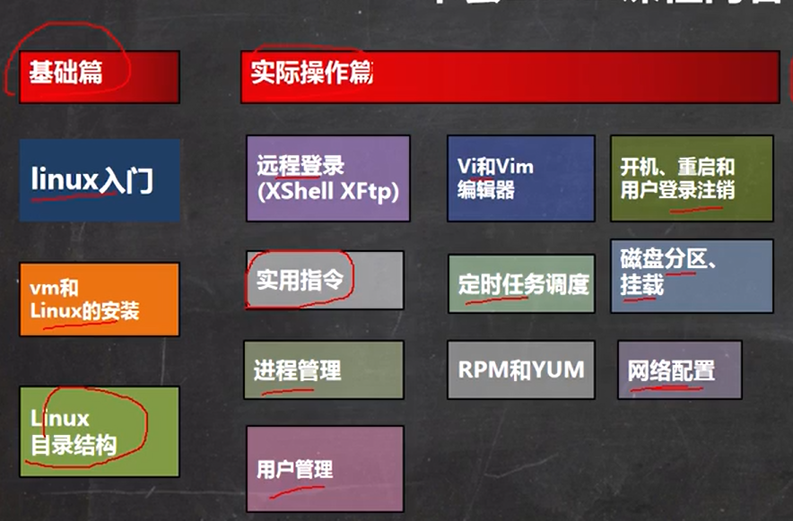
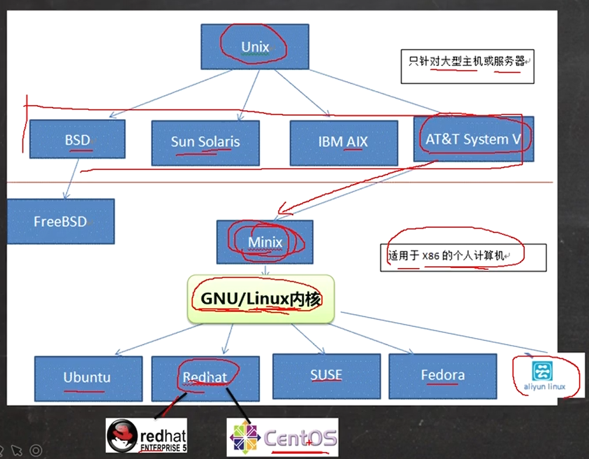
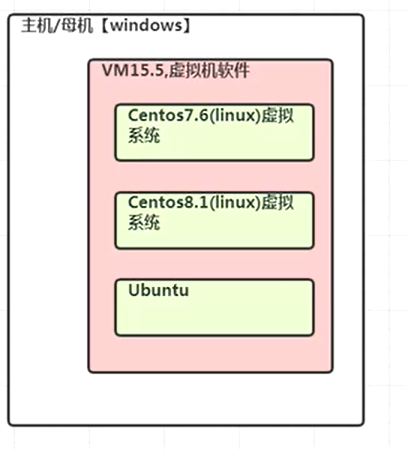
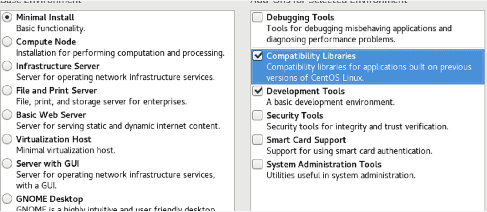
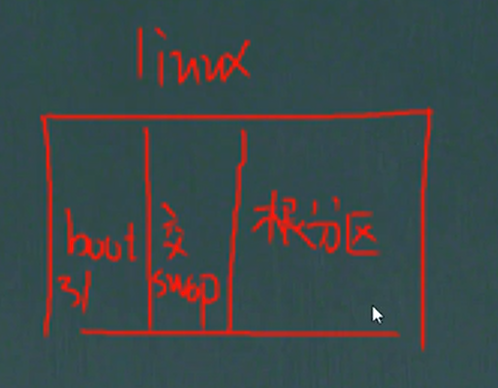
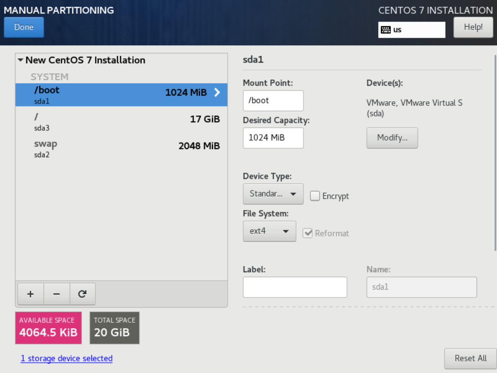
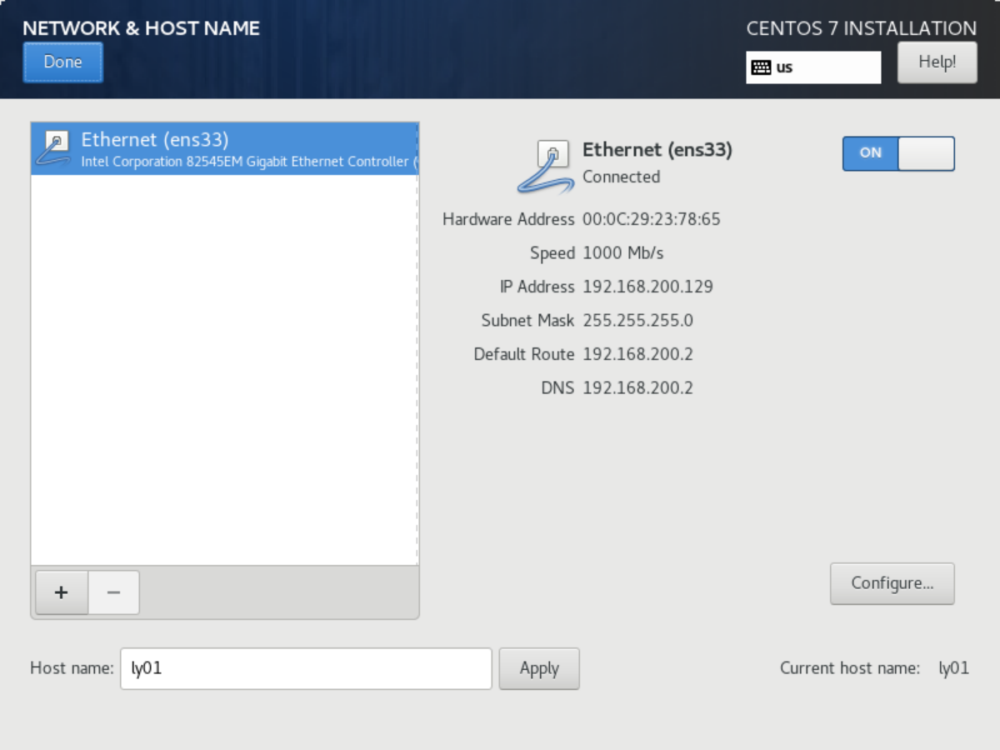
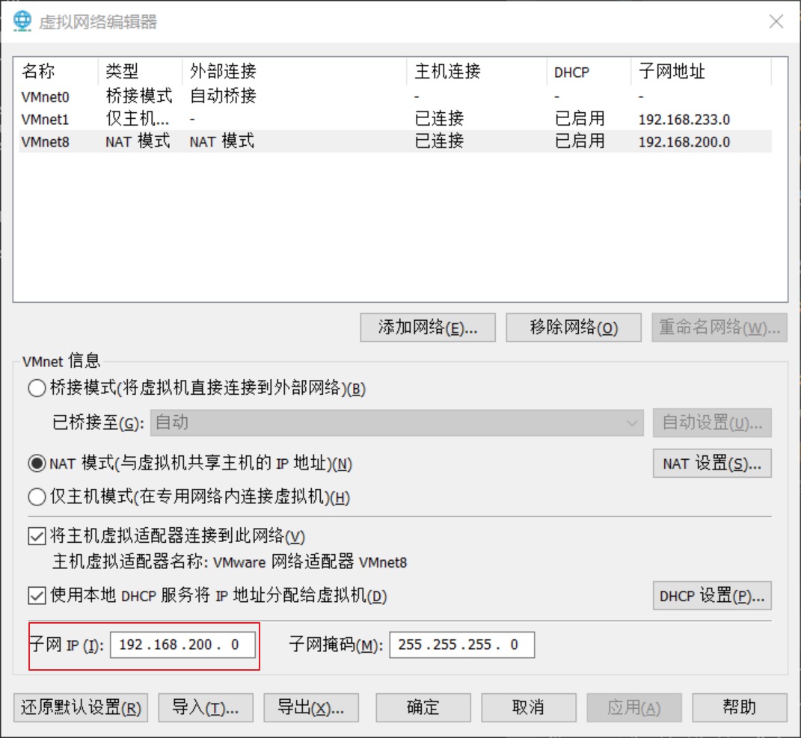
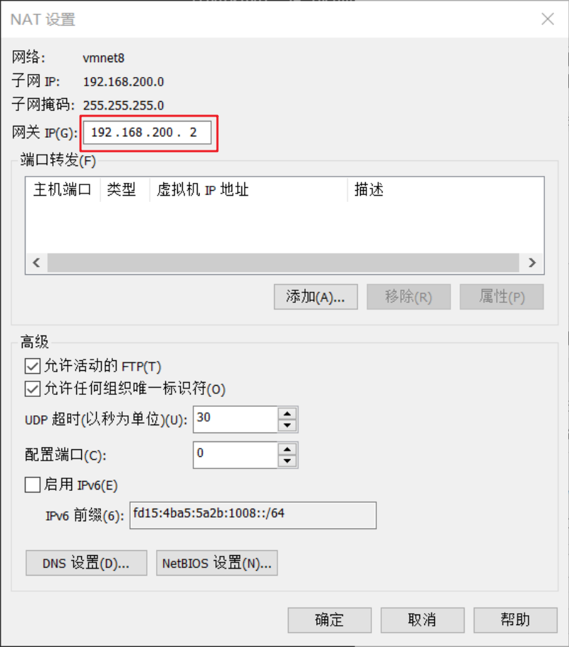

## 基础介绍  
* 本套课程内容   

  * 基础篇: linux入门、vm和Linux的安装、linux目录结构
  * 实操篇
    * 远程登录（xshell，xftp）、实用指令、进程管理、用户管理
    * vi和vim编辑器、定时任务调度、RPM和YUM
    * 开机、重启和用户登录注销、磁盘分区及挂载、网络配置
* linux使用的地方
  * 在linux下开发项目(需要把javaee项目部署到linux下运行)
  * linux运维工程师(服务器规划、优化、监控等)
  * linux嵌入式工程师(linux下驱动开发[c,c++])
* linux应用领域
  * 个人桌面
  * 服务器(免费稳定高效)
  * 嵌入式领域(对软件裁剪，内核最小可达几百kb等)
## linux介绍
* linux是一个开源免费操作系统
* linux吉祥物  
tux(/tu'ks/唾可si)，没找到音标，将就一下  

* linux之父，linus，也是git的创作者  
主要发行版：**Ubuntu、RedHat，Centos**，Debian等  
RedHat和Centos使用同样的源码，但是RedHat收费
* Linux和Unix的关系  
unix也是一个操作系统，贝尔实验室。做一个多用户分时操作系统，
multics，但是没完成。其中一个后来在这基础上，完成的操作系统为unix
（原本是B语言写的），后面和另一个人用unix用c语言改写了。  
unix源码是公开的，后面商业公司拿来包装做成自己的系统，
后面有个人提倡自由时代用户应该对源码享有读写权利而非垄断  
后面RichardStallman发起GNU计划（开源计划），Linus参加该计划，并共享出linux内核，于是大家在此基础上开发出各种软件。linux又称GNU/linux  
* Linux和Unix关系  

## VMWare安装Centos7.6
在windows中安装Linux系统  
* VM和Linux系统在pc中的关系  

* 安装过程中，网络模式使用NAT模式
* 选择最小安装，且选择CompatibilityLibraries和DevelopmentTools  

* linux分区  
一般分为三个  
  
一般boot1G,swap分区一般跟内存大小一致，这里是2G，所以根分区就是剩下的，也就是20-1-2=17G  
如图，boot，/，swap都是标准分区。且boot和/是ext4的文件格式，swap是swap的文件格式  
  
* 修改主机名  

* 修改密码及增加除root外的普通用户
* 修改网络为固定ip(NAT模式下)
  * 先在VM里面把子网ip改了，这里改成
  192.168.200.0  
  
  * 然后改网关为192.168.200.200  
  
  * 使用yum install -y vim 安装文本编辑工具
  * 最后在linux中改配置文件
      ``` 
      vim /etc/sysconfig/network-scripts/ifcfg-ens33
      ```
  * 其中先修改BOOTPROTO="static"
  * 然后设置ip地址、网关和DNS，
  下面是添加到上面的ifcfg-ens33后面，不是直接执行代码
      ``` 
      IPADDR=192.168.200.200
      GATEWAY=192.168.200.2
      DNS1=192.168.200.2
      ```
  * 使用命令重启网络  
      ``` 
      service network restart 
      # 或者直接重启电脑 reboot
      ```
* 这里顺便装一下zsx  
    ``` 
    sh -c "$(wget https://raw.github.com/ohmyzsh/ohmyzsh/master/tools/install.sh -O -)"
    ```
  