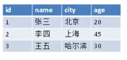
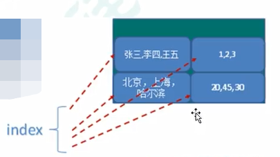
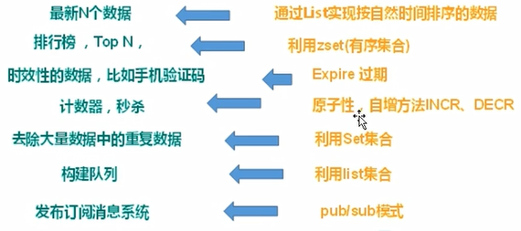
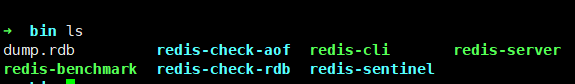
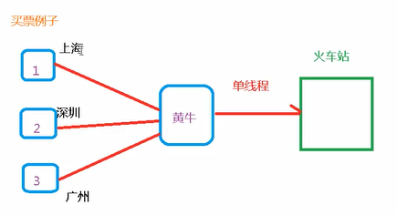

## 课程简介
NoSQL数据库简介、Redis概述与安装、常用五大数据结构、配置文件详解、发布与订阅、Redis6新数据类型、Redis与spring boot整合、事务操作、持久化之RDB、持久化之AOF、主从复制及集群、Redis6应用问题(缓存穿透、击穿、雪崩以及分布式锁)、Redis6新增功能
## NoSQL数据库简介
* Redis属于NoSQL数据库
* 技术分为三大类
  * 解决功能性问题：Java、Jsp、RDBMS、Tomcat、Linux、JDBC、SVN
  * 解决扩展性问题：Struts、Spring、SpringMVC、Hibernate、Mybatis
  * 解决性能问题：NoSQL、Java线程、Nginx、MQ、ElasticSearch
* 缓存数据库的好处
  * 完全在内存中，速度快，结构简单
  * 作为缓存数据库：减少io的读操作  
* NoSQL＝Not Only SQL,不仅仅是SQL，泛指**非泛型数据库**
  * 不支持ACID(但是NoSQL支持事务)
  * 选超于SQL的性能 
* NoSQL适用场景
  * 对数据高并发的读写
  * 海量数据的读写
  * 对数据高可扩展性
* NoSQL不适用的场景
  * 需要事务支持
  * 基于sql的结构化查询存储
* 多种NoSQL数据库介绍 
  * Memcache 不支持持久化，数据类型单一，一般作为辅助持久化的数据库
  * Redis 支持持久化，除了k-v模式还有其他多种数据结构，一般作为辅助持久化的数据库
  * MongoDB，是文档型数据类型；k-v模型，但是对value提供了丰富的查询功能；支持二进制数据及大型对象；替代RDBMS，成为独立数据库
* 大数据时代（行式数据库、列式数据库）
  * 行式数据库  
  查询某一块数据的时候效率高  
    
  * 列式数据库  
  查询某一列统计信息快  
      
  * 其他  
  Hbase，Cassandra，图关系数据库(比如社会关系，公共交通网等)  
* 小计  
NoSQL数据库是为提高性能而产生的非关系型数据库  
## Redis概述与安装  
* 简单概述  
  * Redis是一个开源的kv存储系统  
  * 相比Mencached，支持存储的数据类型更多，包括string，list，set，zset以及hash，这些类型都支持(pop、add/remove及取交并集和差集等)，操作都是原子性的    
  * Redis数据都是缓存在内存中 
  * Redis会周期性地把数据写入磁盘或修改操作写入追加的记录文件
  * 能在此基础上实现master-slave(主从)同步
* Redis功能
  * 配合关系型数据库做高速缓存
  * Redis具有多样的数据结构存储持久化数据
  * 其他部分功能   
    
* Redis安装  
  * 从官网中下载redis-6.xx.tar.gz包(该教程在linux中使用redis6教学)
  * 编译redis需要gcc环境
    * 使用gcc --version查看服务器是否有gcc环境
    * 如果没有需要进行安装
      ```l 
      apt install -y gcc
      或者
      yum install -y gcc
      ```
  * 将redis压缩文件进行解压
      ``` 
      tar -zxvf redis-6xx.tar.gz
      ```
  * 进入解压后的文件夹，并使用make命令进行编译  
    ``` 
    make
    ```
  * 如果报错了，需要先用下面命令清理，之后再进行编译
    ``` 
    make distclean
    ```
  * 安装redis
    ``` 
    make install
    ```
  * 进入/usr/local/bin目录，查看目录  
  
* Redis启动
  * 前台启动
    ``` 
    redis-server 
    ```
  * 后台启动
    * 在刚才解压的文件夹中，拷贝出redis.conf文件(这里拷贝到/etc/目录下)
      ``` 
      cp redis.conf /etc/redis.conf
      ```
    * 到etc中修改redis.conf文件  
      ``` 
      vim /etc/redis.conf
      # 进入编辑器后使用下面命令进行搜索并回车
      /daemonize no
      ```
    将no改为yes并保存
  * 进入/usr/local/bin目录启动redis
    ``` 
    redis-server /etc/redis.conf 
    ```
  * 查看进程，发现redis已经启动
    ``` 
    ps -ef | grep redis
    ``` 
  * 使用redis-cli 客户端连接redis
    ``` 
    redis-cli
    keys * 
    ```
## 相关知识  
* Redis6379的由来
  * 人名Merz 在九宫格对应的数字就是6379  
  
* Redis默认有15个库，默认数据都在数据库0中，所有库的密码都是相同的
* Redis是单线程+多路复用技术  
  * Redis是串行操作  
    
  * 火车站的例子  
  当1，2，3没有票的时候，不用一直等待买票，可以继续做自己的事情，黄牛买到票就会通知123进行取票  
  
* Memcached和Redis区别  
  * Memcached支持单一数据类型，Redis支持多数据类型
  * Memcached不支持持久化  
  * Memcached用的多线程+锁的机制，Redis用的是单线程+多路复用程序
## End
  