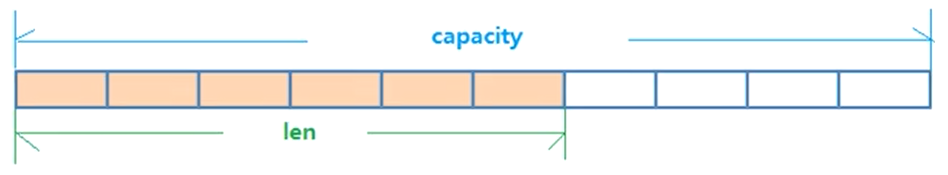
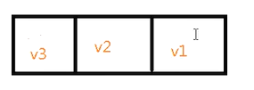
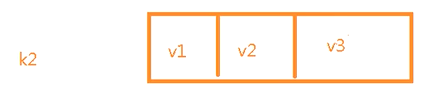
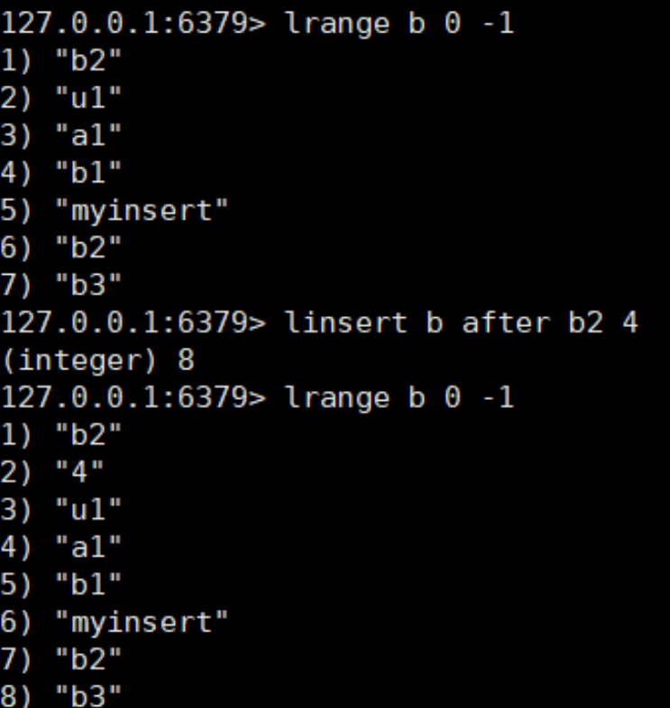
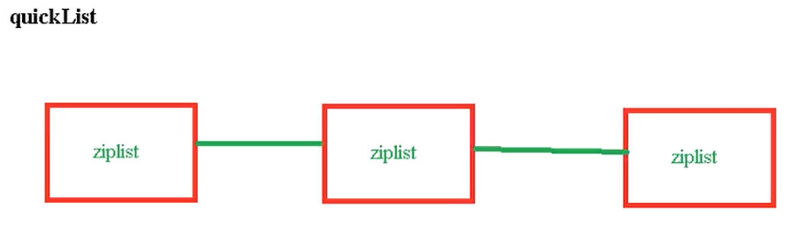
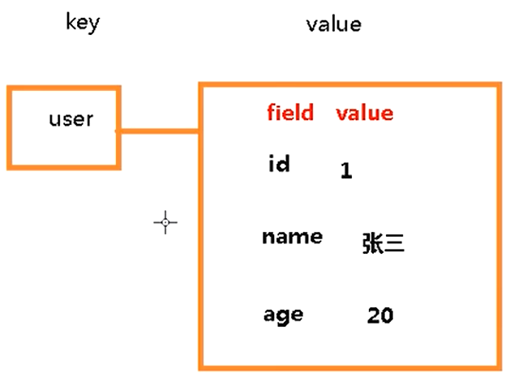
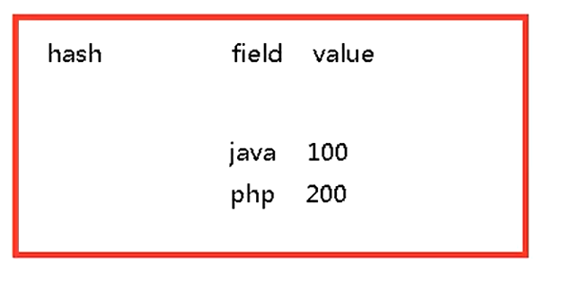
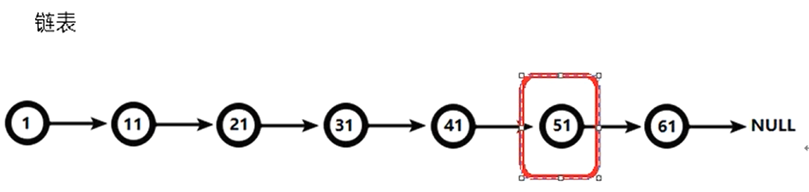
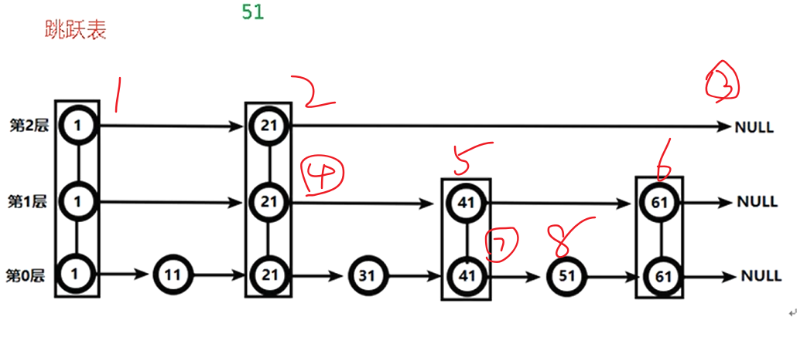

## Redis针对key的基本操作
* 常用命令  
  ``` 
  keys * #查找当前库所有库
  exists key1 #key1是否存在 1存在；0不存在
  type key2 #key2的类型
  del key3 #删除key3
  unlink key3 #删除key3(选择非阻塞删除。会先从元数据删除，而真正删除是异步删除)
  expire key1 10 #设置key1的过期时间，单位秒
  ttl key1 #获取key1的剩余存活时间，-2表示key已过期或不存在，-1表示永不过期
  select 1 #切换到1号库(redis中有15个库，默认在库1)
  dbsize #查找当前redis库中有多少个key
  flushdb #清空当前库
  flushall #清空所有库
  ```
## Redis中常用数据类型
### 字符串（String）
* String是二进制安全的，可以包含jpg图片或序列化的对象
* 一个Redis中字符串value最多可以只能是512M
* 常用命令  
  ``` 
  set key1 value1
  get key1 
  set key1 value11 #将覆盖上一个值
  append key1 abc #在key1的值追加"abc"
  strlen key1 #key值的长度
  setnx key1 value #当key不存在时才设置key
  incr n1 #将n1的值加一,,如果n1不存在则会创建key n1 并改为1(0+1)
  decr n1 #将n1的值减一,如果n1不存在则会创建key n1 并改为-1(0-1)
  incrby n1 20 #将n1的值加20，其他同上
  decrby n1 20 #将n1的值减20，其他同上
  ``` 
* redis原子性  
incr具有原子性操作  
java中的i++不是原子操作  
* 其他命令  
  ``` 
  mset k1 v1 k2 v2
  mget k1 k2 
  msetnx k1 v1 k2 v2 #仅当所有的key都不存在时才会进行设置
  getrange name 0 3 #截断字符串[0,3]
  setrange name 3 123 #从下标[3]开始替换字符串（换成123）
  setex k1 20 v1 #设置过期时间为20s
  expire k1 30 #设置过期时间为30s
  getset k1 123 #获取旧值，并设置一个新值
  ```
* 数据结构，SimpleDynamicString，SDS，简单动态字符串，内部结构类似Java的ArrayList，采用预分配冗余空间的方式来减少内存的频繁分配  
  
### 列表 (List)  
* 单键多值  
* 底层是双向链表  
* 从左放 
  ``` 
  lpush k1 v1 v2 v3 #从左边放(从左往右推)
  lrange k1 0 -1 #从左边取(v3 v2 v1)
  ```
* lpush:  
  
* 从右放  
  ``` 
  rpush k2 v1 v2 v3 
  ```
* brpush:  
  
* lpop/rpop  
  ``` 
  lpop k2 #从左边弹出一个值
  lpop k2 2 #从左边弹出两个值，当键没有包含值时，键被删除
  ```
* rpoplpush  
  ``` 
  lpush a a1 a2 a3
  rpush b b1 b2 b3
  rpoplpush a b #此时a:a1 a2，b:a3 b1 b2 b3
  ```
* lrange
  ``` 
  lrange b 1 2 #获取b中下标[1,2]的所有值
  lrange b 1 -1 #获取所有值[1,最大下标]的所有值
  ```
* lindex,llen
  ``` 
  lindex b 1 #直接取第一个下标的元素
  llen b #获取列表的长度
  ```
* linsert 
  ``` 
  linsert b before b2 myinsert
  linsert b after b2 myinsert
  #在某个列表的值(如果重复取第一个)的位置之前/之后插入值
  ```
  
* lrem,lset
  ``` 
  lrem b 2 a #从b列表中，删除两个a（从左往右）
  lset b 2 AA #把下标2的值设置为AA
  ```
* list数据结构是一个快速列表，quicklist  
当元素较少的时候，会使用连续的内存存储，结构时ziplist，即压缩列表；当数据多的时候会有多个压缩列表，然后会链接到一起(使用双向指针)  

### 集合(Set)
* 特点：无序，不重复  
* Set:string类型的无序集合，底层是一个value为null的hash表；添加/删除时间复杂度为O(1)
* 常用命令  
  ``` 
  sadd k1 v1 v2 v3 v2 v2 v1 #设置集合中的值
  smembers k1 #取出集合中的值
  sismember k1 v3 #k1是否存在v3，存在返回1，不存在返回0
  scard k1 #返回集合中元素的个数
  srem k1 v2 v3 #删除集合中的v2和v3
  spop k1 #从k1中随机取出一个值
  srandmember k1 2 #从k1中随机取出2个值
  ```
  ``` 
  smove a k a1 #从a中将a1移动到k中
  sinter a k #取a，k的交集
  sunion a k #取a，k的并集
  sdiff a k #返回两个集合的差集（从集合a中，去除存在集合k中的元素，即a-k）
  ```
* Set数据结构时dict字典，字典使用哈希表实现的
### 哈希（Hash)
* 是String类型的field和value的映射表，用来存储对象,类似java中的Map<String,Object>    
  
* 常用命令
  ``` 
  hset user:1001 id 1 #设置(对象)user:1001的id属性值
  hset user:1001 name zhangsan 
  hget user:1001 name #取出user:1001的name
  hmset user:1001 id 1 name zhangsan #批量设置（现在hset也可以批量设置了，hmset已弃用）
  hexists user:1001 id 1 #判断属性id是否存在
  hkeys user:1001 #查看hash结构中的所有filed
  hvals user:1001 #查看hash结构中所有value
  hincrby user:1001 age 2 #给hash结构的age属性值加2
  hsetnx user:1001 age 10 #给hash结构的age属性设置值为10（如果age属性不存在）
  ```
* hash类型数据结构，当field-value长度较短时用的是ziplist，否则使用的是hashtable
### 有序集合(ZSet)
* 与set很相似，但是是有序的
* 有序集合的所有元素（成员）都关联一个评分(score)，score用来从最低到最高方式进行排序，成员唯一但评分是重复的
* 常用命令
  ``` 
  zadd topn 100 xiaoming 120 xiaohong 60 xiaochen #添加key并为每个成员添加评分
  zadd topn xiaoli 200 
  zrange topn 0 -1 #查找出所有成员(按排名由小到大)
  zrange topn 0 -1 withscores #从小到大查找所有成员并显示分数
  zrangebyscore topn 130 200 #查找所有在130-200的成员
  zrevrangebyscore topn 200 130 #从大到小查找所有成员（注意，从大到小时第一个值必须大于等于第二个）
  zincrby topn 15 xiaohong #给小红添加15分
  zrem topn xiaohong #删除元素
  zcount topn 10 200 #统计该集合，分数区间内的元素个数
  zrank topn xiaohong #xiaohong的排名，从0开始
  ```
* zset底层数据结构
  * hash结构  
  
  * 跳跃表
  给元素value排序，根据score的范围获取元素列表
  * 对比有序链表和跳跃表  
    * 查找51元素  
    
    * 跳跃表  
    按图中的顺序查找，查找四次就能找到  
    
* End