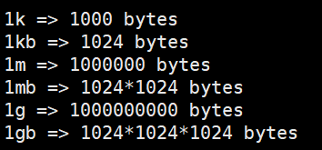
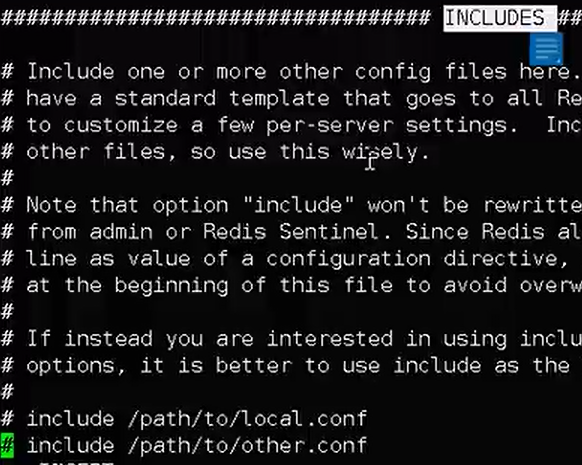
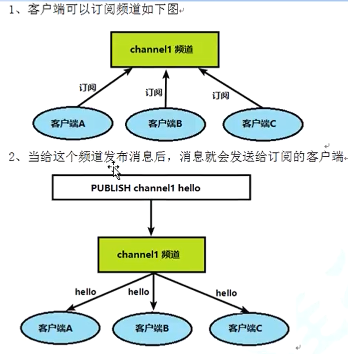
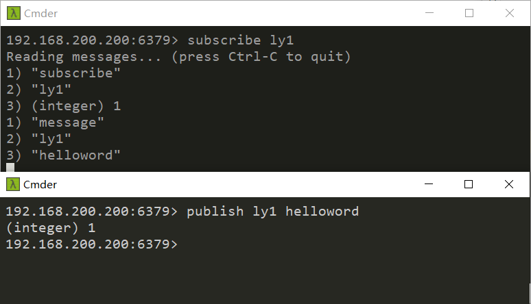
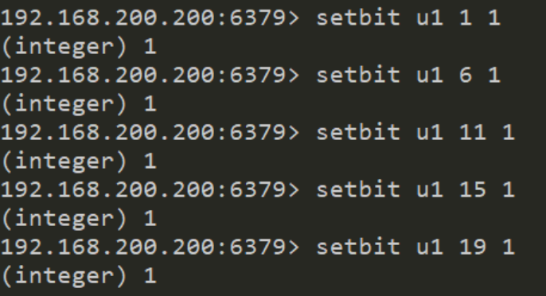
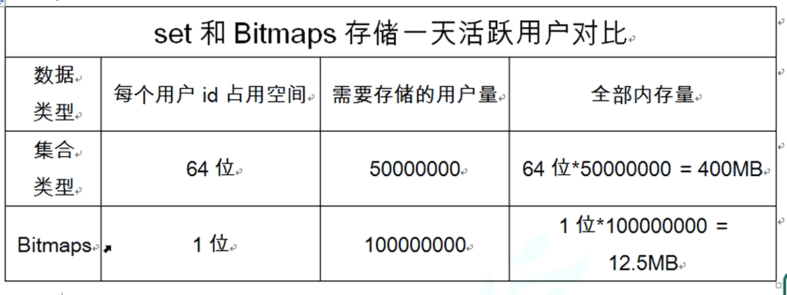

## Redis配置文件
* redis中单位的设置，支持k,kb,m,mb,g,gb，且不区分大小写  

* include (包含其他文件，比如公共部分)  
  
* bind
  ``` 
  bind 127.0.0.1 ::1 #listens on loopback IPv4 and IPv6 
  ```  
  * 后面这个::1，相当于ipv6版的127.0.0.1。在redis配置文件中，整句表示只允许本地网卡的某个ip连接(但是它并不能指定某个主机连接到redis中。比如本机有两个网卡，两个ip，可以限定只有其中一个ip可以连接)
  * 如果注释掉了/或者bind 0.0.0.0，表示允许所有主机连接
* protected-mode 
  ``` 
  protected-mode yes 
  ```
  * 设置保护模式为yes，protected是redis本身的一个安全层，这个安全层在同时满足下面三个条件的时候会开启，开启后只有本机可以访问redis
    * protected-mode yes
    * 没有bind指令(bind 0.0.0.0不属于这个条件)
    * 没有设置密码 (没有设置requirepass password)  
  * 只要上面一个条件不满足，就不会开启保护模式。换言之，只要设置了bind 0.0.0.0或者没有设置bind，且不满足上面三个条件之一，就能够进行远程访问(当然，linux/windows的6379端口要开放) 
* tcp-backlog 表示未连接队列总和  
* timeout 秒为单位，时间内没操作则断开连接
* tcp-keepalive 300 心跳检测，每隔300s检测连接是否存在
* pidfile /var/run/redis_6379.pid 将进程号保存到文件中
* loglevel 表示日志的级别/debug/verbose/**notice**/warning
* logfile ""  设置日志的路径
* database 16 默认有16个库
* requirepass password 设置密码
* maxclients 设置最大连接数
* maxmemory 设置最大内存量，达到则会根据移除策略进行移除操作
## Redis的发布和订阅
* 发布订阅，pub/sub，是一种消息通信模式：发送者pub发送消息，订阅器sub接收消息
* 发布者能发布消息，订阅者可以订阅/接收消息  
  
* 操作  
  ```redis
  subscribe channel1 #客户端A订阅频道 
  ```
  ```redis 
  publish channel1 helloly #向频道发送消息
  ```
  此时订阅channel1频道的客户端就会接收到消息  
  
## redis新数据类型  
### Bitmaps 
  * 进行二进制操作
  * 可以把Bitmaps想象成一个以位为单位的数组，数组的每个单元只能存储0和1，数组的下标在Bitmaps中叫做**偏移量**  
    
  * bitcount:统计字符串被设置为1的bit数，这里结果是5
  * bitcount u1 0 1 #统计字符串第0个字节到第1个字节1的bit数  
  (1,6,11,15,19bit值为1)[也就是统计第0到第15位的1的个数]  
      ``` 
      setbit u1 1 1
      setbit u1 2 1
      setbit u1 5 1
      setbit u1 9 1
      ```
      
      ``` 
      setbit u2 0 1
      setbit u2 1 1
      setbit u2 4 1
      setbit u2 9 1
      ```
  * 获取u1，u2共同位为1的个数，如上1,9都是1，所以返回2，且 bitcount u1--u2的值为2（第1和第9位为1），其实就是**u1和u2进行&操作**    
      ``` 
      bitop and u1-and-u2 u1 u2 
      ```
  * 获取u1或u2存在值为1的位的个数，如上结果为8-2=6，结果存在u1-or-u2中，即1，2，5，9，0，4的位 值为1(的字符串)，其实就是**u1和u2进行或操作**  
  * 性能比较，假设有一亿个用户，用户id数值递增，需求是存储每个用户是否活跃。下面是使用hashMap和bitmaps的比较  
  
  * bitmaps主要用来进行位操作计算
### HyperLogLog
* 解决基数问题  
从{1,3,5,5,7,8,8,7,9}找出基数：基数为5，即不重复元素的个数
* 解决方案
  * mysql中可以用distinct count
  * redis中可以用hash,set,bitmaps
* 使用
  ```  
  pfadd a 1 2 3 4 3 3 3 2 1 6 7
  pfcount a #得到基数 6 
  pfadd b 1 10 7 15 #基数4
  pfmerge c a b #将a，b合并到c
  pfcount c #得到基数8
  ```
### GEO类型  (geographic)  
* 基本命令  
  ``` 
  geoadd china:city 121.47 31.43 shanghai
  geoadd china:city 166.50 29.53 chongqing 114.05 22.52  shenzhen
  geoadd china:city 16.38 39.90 beijing 
  ```
* 不支持南北极，所以有效经度在-180到180度，有效纬度从-85.05xxx度到85.05xxx度
* 获取坐标值及直线距离
  ``` 
  geopos china:city beijing #获取beijing经纬度
  geodist china:city beijing shenzhen km #获取beijing到shenzhen的直线距离
  # 单位有m,km,ft,mi
  ```
* 以给定的经纬度为中心，找出某一半径内的元素  
  ``` 
  georadius china:city 110 30 1000 km
  ```
## End
  